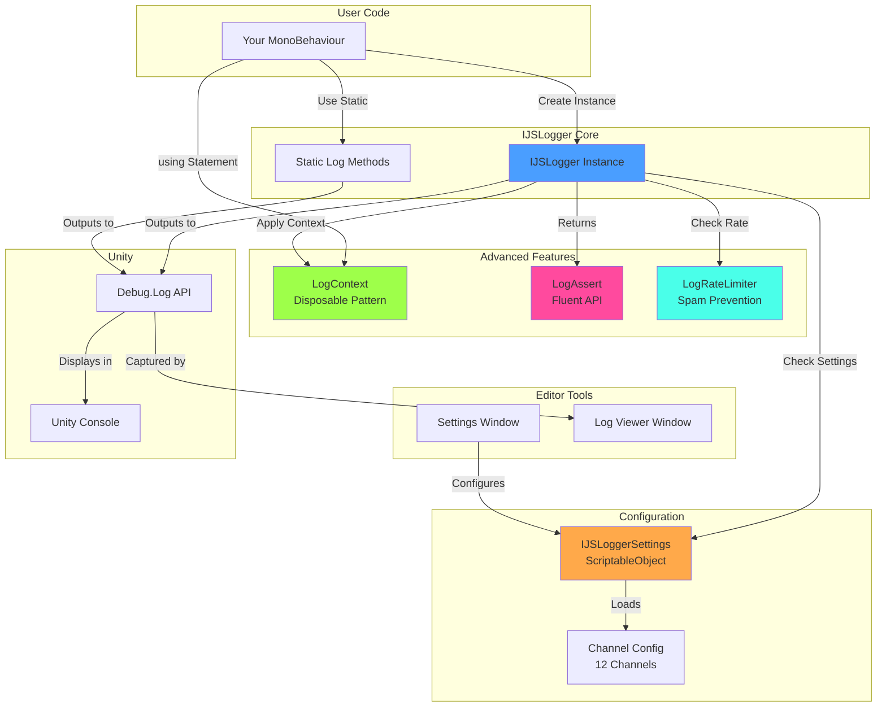
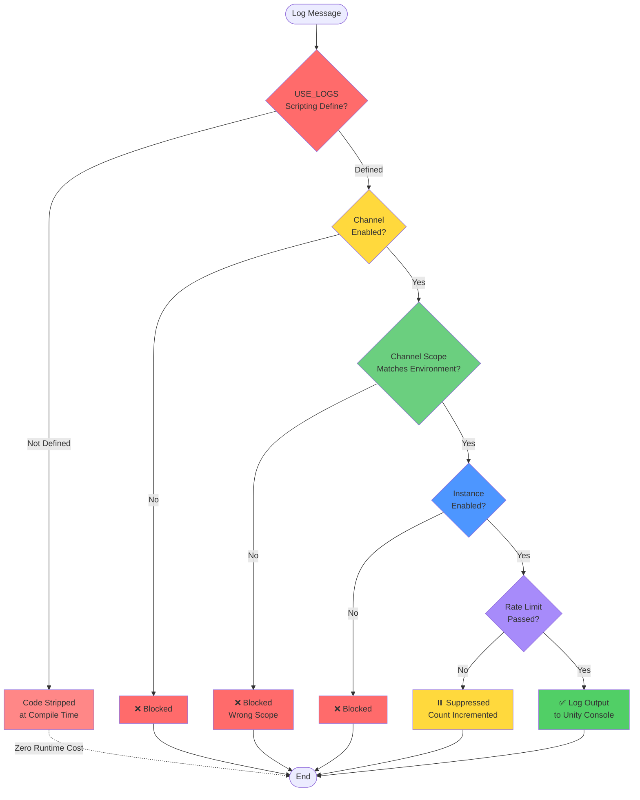
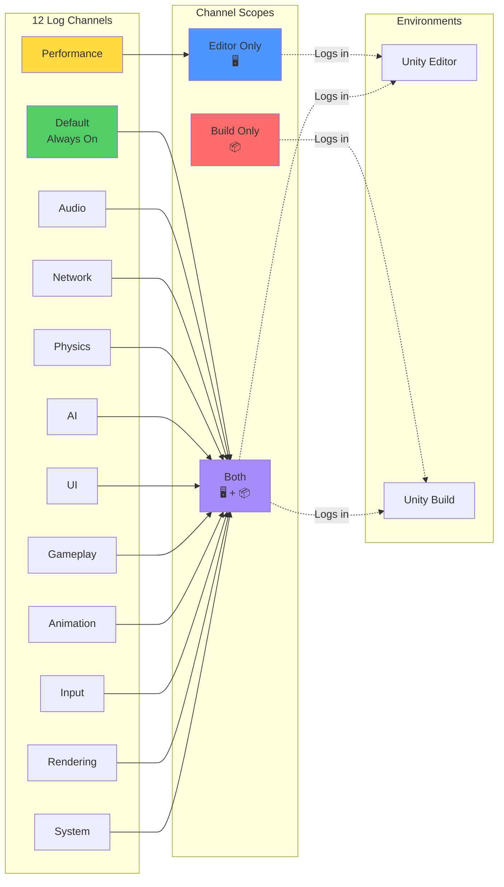
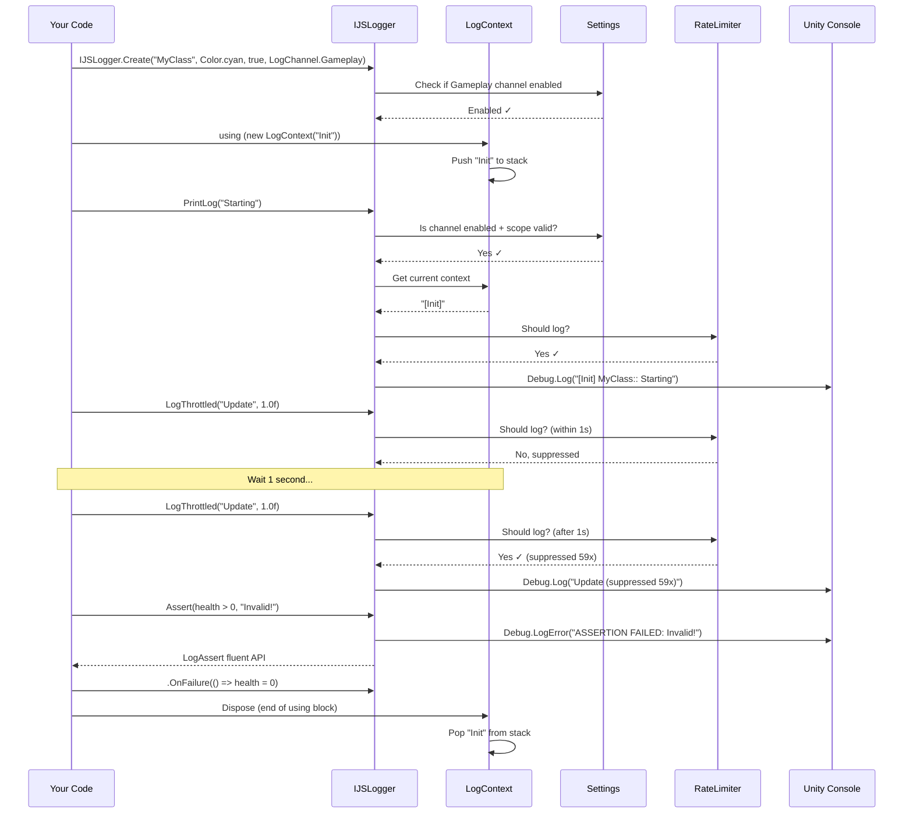

# IJS Logger

Advanced Unity logging system with channel filtering, rate limiting, contexts, assertions, and conditional logging.

## Installation

Select "Add package from git URL" in Unity Package Manager and paste:
```
https://github.com/sathyarajshetigar/IJSLogger.git#upm
```

## Features

### 🎯 Channel-Based Filtering
Organize logs into channels and control them independently. Configure channels to log only in Editor, only in Builds, or Both.

### ⏱️ Smart Rate Limiting
Prevent log spam with automatic rate limiting. Suppressed logs are counted and reported.

### 📝 Log Contexts & Scopes
Add automatic context to your logs using the disposable pattern for cleaner, more organized logging.

### ✅ Assertion System
Fluent assertion API with automatic logging and configurable failure actions.

### 🔍 Conditional Logging
Log only when conditions are met, with support for lazy evaluation to avoid performance costs.

### 🖥️ Editor Integration
- **Settings Window**: Configure channels and their scopes
- **Log Viewer**: View all Unity logs with filtering and search
- **Menu Items**: Quick enable/disable logging

## Architecture & Visual Overview

### System Architecture



### Filtering Hierarchy



### Channel System



### Usage Workflow



## Quick Start

### Basic Usage

```cs
using UnityEngine;
using com.ijs.logger;

public class MyClass : MonoBehaviour
{
    // Create a logger with prefix, color, enabled state, and channel
    private readonly IJSLogger _logger = IJSLogger.Create("MyClass", Color.cyan, true, LogChannel.Gameplay);

    void Start()
    {
        // Simple logging
        _logger.PrintLog("Hello World!");

        // Different log types
        _logger.PrintLog("Warning message", LogType.Warning);
        _logger.PrintLog("Error message", LogType.Error);
    }
}
```

Use `IJSLogger.Create(...)` to avoid allocating a new logger when logging is disabled for that instance or when `USE_LOGS` is not defined.

## Channel System

### Available Channels

- `Default` - Always enabled when USE_LOGS is defined
- `Audio` - Audio system logs
- `Network` - Network/multiplayer logs
- `Physics` - Physics system logs
- `AI` - AI and pathfinding logs
- `UI` - User interface logs
- `Gameplay` - Core gameplay logs
- `Performance` - Performance metrics
- `Animation` - Animation system logs
- `Input` - Input handling logs
- `Rendering` - Rendering system logs
- `System` - General system logs

### Channel Configuration

Create channels with different scopes:

```cs
// Editor-only logger (won't log in builds)
var editorLogger = IJSLogger.Create("Editor", Color.yellow, true, LogChannel.Performance);

// All loggers of the same channel share the same enabled/scope settings
var gameplayLogger = IJSLogger.Create("Gameplay", Color.cyan, true, LogChannel.Gameplay);
```

Configure channels in: **Window → IJS Logger → Settings**

- Enable/disable entire channels
- Set channel scope (Editor Only, Build Only, Both)
- Quick actions (Enable All, Disable All, Reset to Defaults)

## Advanced Features

### Rate Limiting

Prevent console spam from tight loops:

```cs
void Update()
{
    // Only logs once per second, shows suppression count
    _logger.LogThrottled($"FPS: {1f / Time.deltaTime:F1}", 1.0f);
}
```

### Log Contexts

Add automatic context to logs:

```cs
using (new LogContext("Level Loading"))
{
    _logger.PrintLog("Loading assets");

    using (new LogContext("Spawning"))
    {
        // Nested contexts: [Level Loading > Spawning] Spawned 10 enemies
        _logger.PrintLog("Spawned 10 enemies");
    }
}
```

### Conditional Logging

#### Simple Conditions
```cs
// Only log if debugMode is true
_logger.LogIf(debugMode, "Debug information");

// Log warning if health is low
_logger.LogIf(health < 20, "Low health!", LogType.Warning);
```

#### Lazy Evaluation
Avoid expensive string building when logs are disabled:

```cs
_logger.LogIf(
    () => debugMode && isInCombat,
    () => $"Combat Stats: Health={health}, Enemies={enemies.Count}, Position={transform.position}",
    LogType.Log
);
```

### Assertion System

#### Basic Assertions
```cs
// Assert and log error if false
_logger.Assert(health > 0, "Health must be positive!");

// Assert with callback on failure
_logger.Assert(enemyCount <= 100, "Too many enemies!")
    .OnFailure(() => enemyCount = 100);
```

#### Validation Methods
```cs
// Validate not null
_logger.ValidateNotNull(player, nameof(player));

// Validate range
_logger.ValidateRange(health, 0, 100, nameof(health));
```

#### Editor Integration
```cs
// Pause editor on assertion failure (Editor only)
_logger.Assert(isInitialized, "Not initialized!")
    .PauseEditor();

// Break debugger if attached
_logger.Assert(isValid, "Invalid state!")
    .BreakDebugger();
```

## Editor Windows

### Settings Window
**Window → IJS Logger → Settings**

- Configure all channels
- Enable/disable channels
- Set channel scopes (Editor/Build/Both)
- View quick start guide

### Log Viewer
**Window → IJS Logger → Log Viewer**

- View all Unity logs in one place
- Filter by type (Log, Warning, Error)
- Filter to show only IJSLogger logs
- Search logs with text filter
- Auto-scroll option
- Export logs to file
- IJSLogger logs are highlighted

## Global Controls

### Enable/Disable All Logging

**IJS → Logger → Enable Logs** - Adds `USE_LOGS` scripting define
**IJS → Logger → Disable Logs** - Removes `USE_LOGS` scripting define

When disabled, all logging code is completely stripped from builds using `[Conditional("USE_LOGS")]`.

### Hierarchy of Filtering

Logs must pass all these checks to be displayed:

1. ✅ **Global USE_LOGS** (build-time via scripting defines)
2. ✅ **Channel Enabled** (runtime via settings)
3. ✅ **Channel Scope** (Editor/Build/Both)
4. ✅ **Instance Enabled** (runtime via constructor or ToggleLogs)
5. ✅ **Rate Limiting** (runtime per-message throttling)

## Complete Example

```cs
using UnityEngine;
using com.ijs.logger;

public class CompleteExample : MonoBehaviour
{
    // Create loggers for different systems
    private readonly IJSLogger _gameplay = IJSLogger.Create("Gameplay", Color.cyan, true, LogChannel.Gameplay);
    private readonly IJSLogger _network = IJSLogger.Create("Network", Color.green, true, LogChannel.Network);
    private readonly IJSLogger _perf = IJSLogger.Create("Perf", Color.magenta, true, LogChannel.Performance);

    [SerializeField] private float health = 100f;

    void Start()
    {
        // Basic logging
        _gameplay.PrintLog("Game started");

        // With context
        using (new LogContext("Initialization"))
        {
            _network.PrintLog("Connecting to server");
            _gameplay.PrintLog("Loading player data");
        }

        // Assertions
        _gameplay.ValidateRange(health, 0, 100, nameof(health));

        // Conditional logging with lazy evaluation
        _gameplay.LogIf(
            () => health < 50,
            () => $"Health critical: {health}",
            LogType.Warning
        );
    }

    void Update()
    {
        // Rate-limited performance logging
        _perf.LogThrottled($"FPS: {1f / Time.deltaTime:F1}", 1.0f);
    }

    void TakeDamage(float damage)
    {
        using (new LogContext("Combat"))
        {
            health -= damage;
            _gameplay.PrintLog($"Took {damage} damage. Health: {health}");

            // Assert with action
            _gameplay.Assert(health >= 0, "Health cannot be negative!")
                .OnFailure(() => health = 0);
        }
    }
}
```

## API Reference

### IJSLogger Constructor
```cs
IJSLogger(string prefix = "", Color? color = null, bool logsEnabled = true, LogChannel channel = LogChannel.Default)
```

### Instance Methods

| Method | Description |
|--------|-------------|
| `PrintLog(message, logType, gameObject)` | Log a message with instance settings |
| `LogIf(condition, message, logType, gameObject)` | Log only if condition is true |
| `LogIf(conditionFunc, messageFunc, logType, gameObject)` | Lazy evaluation conditional logging |
| `LogThrottled(message, minIntervalSeconds, logType, gameObject)` | Rate-limited logging |
| `Assert(condition, message)` | Assert condition, returns fluent LogAssert |
| `ValidateNotNull(obj, paramName)` | Validate object is not null |
| `ValidateRange(value, min, max, paramName)` | Validate value is in range |
| `EnableLogs()` | Attempts to enable this logger. Returns `false` when the logger was already disabled and must be recreated |
| `DisableLogs()` | Disable this logger instance; returns `true` when it changed state |
| `ModifyPrefix(prefix)` | Change the log prefix |
| `ModifyColor(color)` | Change the log color |

### Static Methods

| Method | Description |
|--------|-------------|
| `Log(message, type, gameObject, color)` | Static logging method |

### LogContext

```cs
using (new LogContext("ContextName"))
{
    // Logs here will include [ContextName] prefix
}
```

### LogAssert

```cs
logger.Assert(condition, message)
    .OnFailure(() => { /* callback */ })
    .BreakDebugger()
    .PauseEditor();  // Editor only
```

## Configuration

### Creating Settings Asset

1. Create folder: `Assets/_PackageRoot/Runtime/Resources/`
2. Right-click → Create → IJS → Logger Settings
3. Name it `IJSLoggerSettings`
4. Configure channels as needed

Or use **Window → IJS Logger → Settings** and click "Create Settings Asset".

### Default Channel Scopes

By default:
- `Performance` channel is **Editor Only**
- All other channels are **Both**

You can customize this in the settings window or by code:

```cs
var settings = IJSLoggerSettings.Instance;
settings.SetChannelEnabled(LogChannel.Performance, true);
settings.SetChannelScope(LogChannel.Performance, ChannelScope.EditorOnly);
```

## Best Practices

1. **Use Channels**: Organize logs by system (Audio, Network, Gameplay, etc.)
2. **Use Contexts**: Add context to related log groups
3. **Rate Limit in Loops**: Always throttle logs in Update/FixedUpdate
4. **Lazy Evaluation**: Use function parameters for expensive string building
5. **Configure Scopes**: Set Performance logs to Editor-only
6. **Use Assertions**: Validate assumptions during development
7. **Color Code**: Use consistent colors for different systems

## Performance

- **Zero Cost in Production**: When `USE_LOGS` is not defined, all logging code is stripped via `[Conditional]`
- **Minimal Runtime Cost**: Channel checks and instance flags are simple boolean comparisons
- **Smart Rate Limiting**: Only tracks messages that are actually rate-limited
- **Lazy Evaluation**: Expensive operations only execute when logs will be displayed

## Changelog

### Version 1.1.0
- ✨ Added channel-based filtering system
- ✨ Added smart rate limiting
- ✨ Added log contexts with disposable pattern
- ✨ Added assertion system with fluent API
- ✨ Added conditional logging with lazy evaluation
- ✨ Added Settings window for channel configuration
- ✨ Added Log Viewer window for all Unity logs
- ✨ Added ChannelScope (Editor/Build/Both)
- 🔧 Updated package description
- 📚 Comprehensive documentation and examples

### Version 1.0.11
- Initial release with basic logging functionality

## Support

For issues, questions, or feature requests, please visit the GitHub repository.

---

Happy Logging! 🎉
