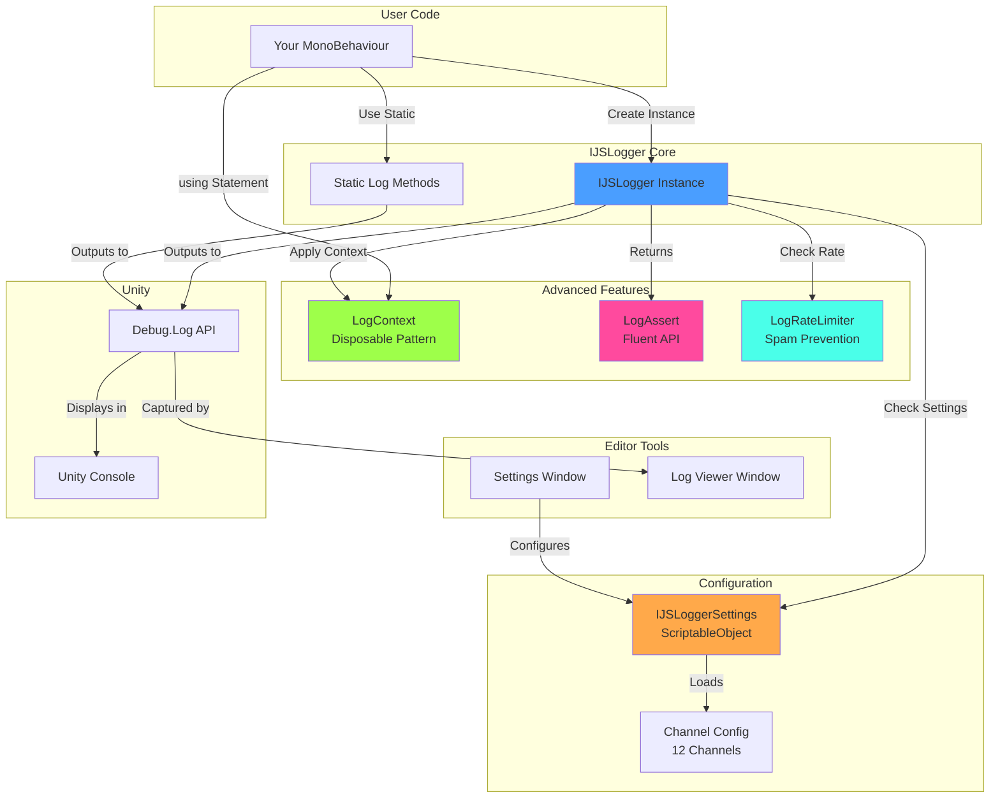
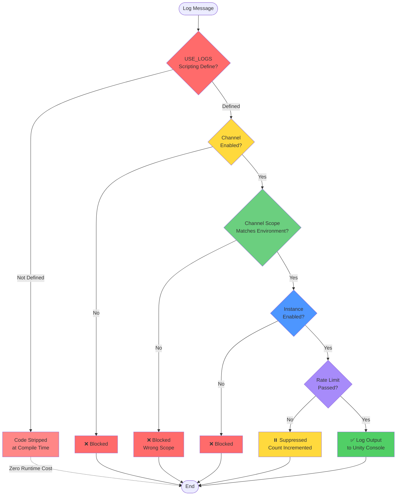
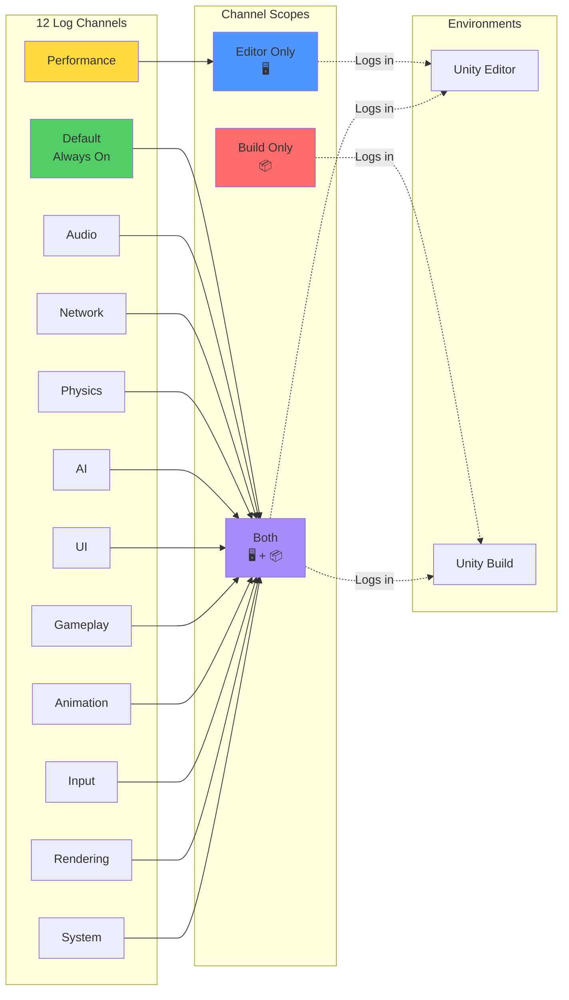
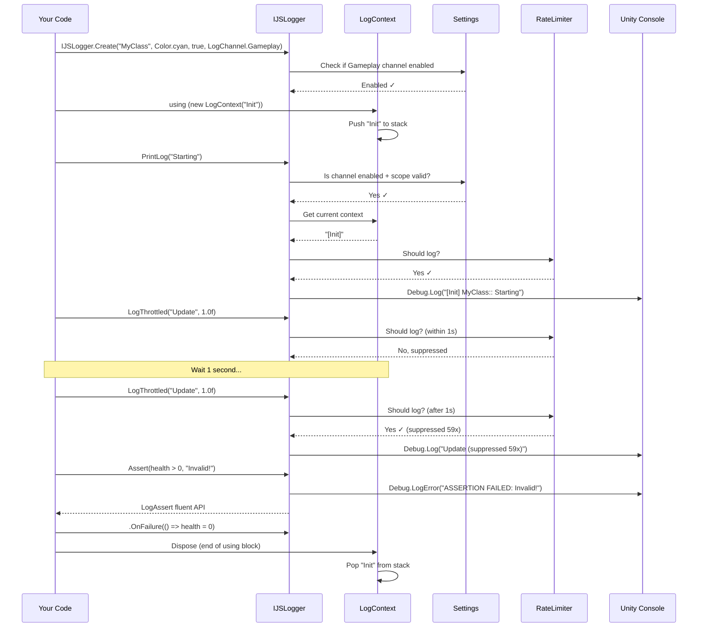
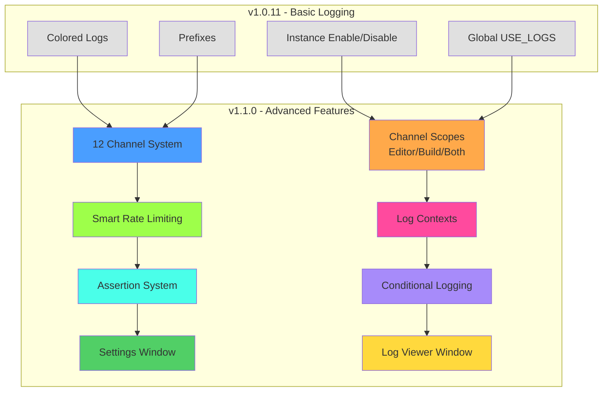

# IJS Logger

Advanced Unity logging system with channel filtering, rate limiting, contexts, assertions, and conditional logging.

## Installation

Select "Add package from git URL" in Unity Package Manager and paste:
```
https://github.com/sathyarajshetigar/IJSLogger.git#upm
```

## What's New in v1.3.0

### 🧩 Extensible Channels — `LogChannelAsset`
The built-in `LogChannel` enum is no longer the only way to define channels. Create as many
project-specific channels as you need without editing package source — just right-click in the
Project window and pick **Create → IJS → Log Channel**:

```csharp
// Use the asset directly:
private readonly IJSLogger _replay = IJSLogger.Create(myReplayChannelAsset);

// Or just use a string id (matches LogChannelAsset.Id):
private readonly IJSLogger _replay = IJSLogger.Create("Replay", Color.cyan, true, channelId: "Replay");
```

The id is used as the Unity console `[Tag]`, so Unity's native tag filter and the IJSLogger
**Log Viewer** window both pick it up. Drop the asset into the **Custom Channels** list on
your `IJSLoggerSettings` asset (or call `IJSLoggerSettings.RegisterCustomChannel(asset)` at
startup) to make it appear in the Settings window with the same enabled/scope/min-severity
controls as the built-in channels.

### 🪪 No More Per-Class Boilerplate — `IIJSLoggable`
Tired of declaring `private static readonly IJSLogger Log = IJSLogger.Create(...)` (and the
matching `logsEnabled`/color/prefix fields) on every class — and forgetting one? Add the
`IIJSLoggable` marker interface and an optional `[LogConfig]` attribute, and call the
`this.Log(...)` extension methods directly:

```csharp
[LogConfig(prefix = "Audio", channel = LogChannel.Audio, colorHex = "#FFD000")]
public class AudioMixer : MonoBehaviour, IIJSLoggable
{
    void Play()
    {
        this.Log("playing");                   // no fields, no Create call
        this.LogWarning("mixer hot");
        this.LogThrottled("polling", 1.0f);
        this.Assert(volume >= 0, "negative volume");
    }
}
```

`IJSLoggerRegistry` caches one `IJSLogger` per `Type` (concurrent dictionary), reads the
attribute once via reflection, and reuses the instance for every call. All extension methods
are `[Conditional("USE_LOGS")]`, so calls disappear in production exactly like the rest of
the API.

## What's New in v1.2.0

Improvements inspired by *"Unity's Logger Does More Than You Think"* (Gamedev Engine Room):

### 🔗 Clickable Console Logs (Caller Info)
Every log now appends a `(at path:line)` link pointing back to the **call site** instead of `IJSLogger.cs`.
Powered by `[CallerFilePath]` / `[CallerLineNumber]` attributes — zero runtime cost, no `StackTrace` walking.
Double-click any log in the Unity console to jump to the line that produced it.

### 🪝 Global Handler — Capture Every Log
```csharp
IJSLogger.InstallGlobalHandler();
```
Routes **every** log going through `Debug.unityLogger` (raw `Debug.Log`, third-party packages,
internal Unity logs) through the IJSLogger pipeline so they hit your channel filter, rate limiter
and any registered sinks.

### 🔌 Pluggable Sinks (`ILogSink`)
Fan logs out to multiple destinations. Built-in:
- `UnityConsoleSink` — default, writes via the original Unity handler.
- `FileLogSink` — size-based rolling file sink, thread-safe, ideal for shipped builds.

```csharp
IJSLogger.AddSink(new FileLogSink(
    Path.Combine(Application.persistentDataPath, "Logs", "game.log"),
    maxFileSizeBytes: 5 * 1024 * 1024,
    maxRolledFiles: 5));
```

### 🎚️ Severity Filtering
- **Global** `LogsEnabled` and `GlobalMinLogType` on `IJSLoggerSettings` apply to `Debug.unityLogger.logEnabled` / `filterLogType`.
- **Per-channel** `minLogType` on `ChannelConfig` — e.g. set `Performance` to `Warning` and above.

### 🏷️ Channel Tag Overload
Logs use `Debug.unityLogger.Log(LogType, tag, message)` so the channel name appears as Unity's
native `[Tag]`, benefiting from Unity's built-in console filter UI.

### 🧨 Real Exception Logging
```csharp
try { ... }
catch (Exception ex) { _logger.PrintException(ex); }
```
Routes through `ILogHandler.LogException` so the exception type and stack trace are preserved
end-to-end (instead of being flattened into a string).

### 🔒 Thread-Safe State
- `LogContext` now uses `AsyncLocal<Stack<string>>` — flows across `await` and is isolated per logical thread.
- `LogRateLimiter` uses a `ConcurrentDictionary` with a soft-LRU bound (`MaxEntries` / `TrimTo`)
  so the cache no longer grows unbounded.

### ⚡ Zero-Alloc Hot Paths
- The "highlight numbers" feature is now **opt-in** (`logger.HighlightNumbers = true`) and uses
  a single-pass `StringBuilder` scan instead of `string.Split` + per-word `int.TryParse`.
- `EnableLogs()` is now actually implemented (previously a no-op).

## What's New in v1.1.0

### 🎯 Channel-Based Filtering
Organize logs into channels (Audio, Network, Physics, AI, UI, Gameplay, Performance, etc.) and control them independently. Configure channels to log only in Editor, only in Builds, or Both.

### ⏱️ Smart Rate Limiting
Prevent log spam with automatic rate limiting. Suppressed logs are counted and reported.

### 📝 Log Contexts & Scopes
Add automatic context to your logs using the disposable pattern:
```csharp
using (new LogContext("Level Loading"))
{
    _logger.PrintLog("Loading assets"); // [Level Loading] Loading assets
}
```

### ✅ Assertion System
Fluent assertion API with automatic logging:
```csharp
_logger.Assert(health > 0, "Health must be positive!")
    .OnFailure(() => health = 0)
    .PauseEditor();
```

### 🔍 Conditional Logging
Log only when conditions are met, with lazy evaluation support:
```csharp
_logger.LogIf(() => debugMode, () => $"Debug: {expensiveOperation()}");
```

### 🖥️ Editor Windows
- **Settings Window** (`Window → IJS Logger → Settings`): Configure channels and scopes
- **Log Viewer** (`Window → IJS Logger → Log Viewer`): View all Unity logs with filtering

## Architecture & Visual Overview

### System Architecture



### Filtering Hierarchy



### Channel System



### Usage Workflow



### Feature Comparison



## Quick Start

### Basic Usage

```csharp
using UnityEngine;
using com.ijs.logger;

public class MyGame : MonoBehaviour
{
    // Create logger with channel
    private readonly IJSLogger _logger = IJSLogger.Create("MyGame", Color.cyan, true, LogChannel.Gameplay);

    void Start()
    {
        // Simple logging
        _logger.PrintLog("Game started!");

        // Different log types
        _logger.PrintLog("Warning!", LogType.Warning);
        _logger.PrintLog("Error!", LogType.Error);
    }
}
```

Use `IJSLogger.Create(...)` as the preferred creation path when you want to skip allocating a real logger while instance logging is disabled or `USE_LOGS` is not defined.

### Advanced Usage

```csharp
public class AdvancedExample : MonoBehaviour
{
    private readonly IJSLogger _gameplay = IJSLogger.Create("Gameplay", Color.cyan, true, LogChannel.Gameplay);
    private readonly IJSLogger _perf = IJSLogger.Create("Perf", Color.magenta, true, LogChannel.Performance);

    [SerializeField] private float health = 100f;

    void Start()
    {
        // Context-based logging
        using (new LogContext("Initialization"))
        {
            _gameplay.PrintLog("Loading level");
            _gameplay.PrintLog("Spawning player");
        }

        // Assertions
        _gameplay.Assert(health > 0, "Health must be positive!");
        _gameplay.ValidateRange(health, 0, 100, nameof(health));

        // Conditional logging with lazy evaluation
        _gameplay.LogIf(
            () => health < 20,
            () => $"Low health: {health}",
            LogType.Warning
        );
    }

    void Update()
    {
        // Rate-limited logging (prevents spam)
        _perf.LogThrottled($"FPS: {1f / Time.deltaTime:F1}", 1.0f);
    }

    void TakeDamage(float damage)
    {
        using (new LogContext("Combat"))
        {
            health -= damage;
            _gameplay.PrintLog($"Took {damage} damage. Health: {health}");

            // Assert with callback
            _gameplay.Assert(health >= 0, "Health cannot be negative!")
                .OnFailure(() => health = 0);
        }
    }
}
```

## Channel System

### Built-in Channels

| Channel | Description | Default Scope |
|---------|-------------|---------------|
| `Default` | Always enabled | Both |
| `Audio` | Audio system logs | Both |
| `Network` | Network/multiplayer logs | Both |
| `Physics` | Physics system logs | Both |
| `AI` | AI and pathfinding logs | Both |
| `UI` | User interface logs | Both |
| `Gameplay` | Core gameplay logs | Both |
| `Performance` | Performance metrics | Editor Only |
| `Animation` | Animation system logs | Both |
| `Input` | Input handling logs | Both |
| `Rendering` | Rendering system logs | Both |
| `System` | General system logs | Both |

### Adding / Updating Channels

You have three options, in increasing order of integration:

**1. String id (lowest friction)** — pass any string to the `channelId` overloads. The id is
used as the Unity console tag and as the lookup key for filter configs.

```csharp
var logger = IJSLogger.Create("Replay", Color.cyan, true, channelId: "Replay");
logger.PrintLog("buffer flushed");
```

Configure it from code at startup:

```csharp
var settings = IJSLoggerSettings.Instance;
settings.SetChannelEnabled("Replay", true);
settings.SetChannelScope("Replay", ChannelScope.Both);
```

**2. `LogChannelAsset` (recommended)** — create a ScriptableObject that carries the id,
default color, scope and minimum severity. Right-click in the Project window →
**Create → IJS → Log Channel**, name it (the asset name becomes the default `Id`), tweak
the color/scope/min-severity in the inspector, then either:

- Drag the asset into the **Custom Channels** list on your `IJSLoggerSettings` asset, or
- Call `IJSLoggerSettings.Instance.RegisterCustomChannel(myAsset)` at startup.

It will then appear in **Window → IJS Logger → Settings** alongside the built-in channels.
Construct loggers from it directly:

```csharp
[SerializeField] private LogChannelAsset replayChannel;
private IJSLogger _replay;

void Awake() => _replay = IJSLogger.Create(replayChannel);
```

**3. Extending the `LogChannel` enum** — only do this if you're forking the package. Adding
a value to the enum requires a recompile, breaks asset reordering (Unity stores enum values
as ints), and is generally inferior to the string-keyed approach above.

### Channel Scopes

- **Editor Only**: Logs only in Unity Editor (not in builds)
- **Build Only**: Logs only in builds (not in editor)
- **Both**: Logs in both editor and builds

### Configuring Channels

**In Editor:**
1. Open `Window → IJS Logger → Settings`
2. Enable/disable channels (built-in and custom)
3. Set channel scope for each
4. Use quick actions (Enable All, Disable All, Reset)

**In Code:**
```csharp
var settings = IJSLoggerSettings.Instance;
settings.SetChannelEnabled(LogChannel.Performance, true);
settings.SetChannelScope(LogChannel.Performance, ChannelScope.EditorOnly);

// Same API for custom string-keyed channels:
settings.SetChannelEnabled("Replay", false);
```

## Per-Class Logging via `IIJSLoggable`

The most common reason logs go missing is that someone forgot to declare the
`private readonly IJSLogger _log = IJSLogger.Create(...)` field on a new class. The
`IIJSLoggable` marker interface eliminates that boilerplate entirely.

**Step 1.** Mark the class and (optionally) annotate it with `[LogConfig]`:

```csharp
[LogConfig(prefix = "Audio", channel = LogChannel.Audio, colorHex = "#FFD000")]
public class AudioMixer : MonoBehaviour, IIJSLoggable { }

// Custom channel id instead of the enum:
[LogConfig(prefix = "Telemetry", channelId = "Telemetry", colorHex = "#7CB7FF")]
public class TelemetryUploader : MonoBehaviour, IIJSLoggable { }

// Attribute is optional. Without it, the prefix defaults to the type name and
// the channel defaults to LogChannel.Default.
public class HudController : MonoBehaviour, IIJSLoggable { }
```

**Step 2.** Call the extension methods on `this`:

```csharp
this.Log("started");
this.LogWarning("almost out of memory");
this.LogError("payload was null");
this.LogException(ex);
this.LogIf(() => debugMode, () => $"stats {Heavy()}");
this.LogThrottled("frame info", 1.0f);
this.Assert(health > 0, "health must be positive").OnFailure(() => health = 0);
```

How it works: `IJSLoggerRegistry` keeps a `ConcurrentDictionary<Type, IJSLogger>`. The first
call for a given type reads the attribute via reflection and constructs a logger; every
subsequent call is a dictionary lookup. The extension methods are `[Conditional("USE_LOGS")]`,
so the call sites — including `this` and any boxed argument expressions — are stripped at
compile time when `USE_LOGS` isn't defined.

`[LogConfig]` properties:

| Field | Default | Description |
|-------|---------|-------------|
| `prefix` | type name | Prepended to every message (`"Audio:: ..."`). |
| `colorHex` | `"#FFFFFF"` | Editor color, e.g. `"#FFD000"` or `"#FFD000FF"`. |
| `channel` | `LogChannel.Default` | Built-in enum channel. |
| `channelId` | `null` | Custom string channel id. Wins over `channel` when set. |
| `logsEnabled` | `true` | Initial enabled state for the type's logger. |
| `highlightNumbers` | `false` | Mirrors `IJSLogger.HighlightNumbers`. |

If you need a per-instance override (e.g. two instances of the same type with different
colors), keep using the explicit `IJSLogger.Create(...)` field for those — `IIJSLoggable`
is type-scoped on purpose.

## Filtering Logs on Mobile Devices

Mobile builds need a slightly different toolkit because there's no Unity console attached.
IJSLogger supports four complementary patterns:

**1. Strip everything in shipping builds.** When `USE_LOGS` isn't defined, every IJSLogger
call (including the `IIJSLoggable` extensions) is removed by the C# compiler via
`[Conditional("USE_LOGS")]`. Disable the define from **IJS → Logger → Disable Logs** before
producing release builds and there is literally zero log code on the device.

**2. Filter at runtime via `IJSLoggerSettings`.** For QA / TestFlight / internal builds keep
`USE_LOGS` defined but raise the bar:

```csharp
var s = IJSLoggerSettings.Instance;
s.GlobalMinLogType = LogType.Warning;   // suppress info-level globally
s.SetChannelEnabled("Telemetry", false);
s.SetChannelScope(LogChannel.Performance, ChannelScope.EditorOnly);
s.LogsEnabled = false;                  // master kill switch
```

These can be driven by remote config so you can toggle logs on a live build without
shipping a new binary.

**3. Persist to a file with `FileLogSink`.** Mobile devices are headless: instead of a
console, dump everything to `Application.persistentDataPath` and pull it later via
`adb pull` (Android), Xcode → *Devices and Simulators* → *Download Container* (iOS), or
via your in-app "Send logs" button:

```csharp
void Awake()
{
    IJSLogger.InstallGlobalHandler();   // captures Debug.Log + 3rd-party logs too
    IJSLogger.AddSink(new FileLogSink(
        System.IO.Path.Combine(Application.persistentDataPath, "Logs", "game.log"),
        maxFileSizeBytes: 5 * 1024 * 1024,
        maxRolledFiles: 5));
}
```

Pair it with the channel filter above to keep the file size manageable. The sink is
thread-safe and rolls files over at the size threshold.

**4. Read the platform log stream.** When the device is tethered to a developer machine,
Unity's normal log pipeline is exposed by the OS:

- **Android:** `adb logcat -s Unity` (or filter by tag, e.g. `adb logcat Unity:V Audio:V *:S`).
  Channel ids and `LogChannel` names appear as the Unity tag, so `adb logcat Unity:S Replay:V`
  shows only logs from the `Replay` channel.
- **iOS:** open Xcode → *Devices and Simulators* → *Open Console*, or use macOS Console.app
  and filter by your app's process; Unity's logs and the IJSLogger tags show up there.
- **In-game overlay:** add a tiny custom `ILogSink` that pushes entries into a ring buffer
  and renders them via IMGUI / UI Toolkit. Combined with `IJSLogger.InstallGlobalHandler()`
  this catches every log the engine produces.

## Key Features

### 1. Rate Limiting

Prevent console spam from tight loops:

```csharp
void Update()
{
    // Only logs once per second, shows suppression count
    _logger.LogThrottled($"Player position: {transform.position}", 1.0f);
    // Output after 1 second: "Player position: (1,2,3) (suppressed 59x)"
}
```

### 2. Log Contexts

Add hierarchical context to logs:

```csharp
using (new LogContext("Level Loading"))
{
    _logger.PrintLog("Loading assets");

    using (new LogContext("Spawning"))
    {
        // Output: [Level Loading > Spawning] Spawned 10 enemies
        _logger.PrintLog("Spawned 10 enemies");
    }
}
```

### 3. Conditional Logging

#### Simple Conditions
```csharp
_logger.LogIf(debugMode, "Debug information");
_logger.LogIf(health < 20, "Low health!", LogType.Warning);
```

#### Lazy Evaluation
Avoid expensive operations when logs are disabled:
```csharp
_logger.LogIf(
    () => debugMode && isInCombat,
    () => $"Stats: Health={health}, Enemies={enemies.Count}, Pos={transform.position}",
    LogType.Log
);
```

### 4. Assertions

#### Basic Assertions
```csharp
_logger.Assert(health > 0, "Health must be positive!");
```

#### With Callbacks
```csharp
_logger.Assert(enemyCount <= 100, "Too many enemies!")
    .OnFailure(() => enemyCount = 100);
```

#### Validation Helpers
```csharp
_logger.ValidateNotNull(player, nameof(player));
_logger.ValidateRange(health, 0, 100, nameof(health));
```

#### Editor Integration
```csharp
_logger.Assert(isInitialized, "Not initialized!")
    .PauseEditor()      // Pauses Unity Editor (Editor only)
    .BreakDebugger();   // Breaks if debugger attached
```

## Editor Windows

### Settings Window
**Window → IJS Logger → Settings**

Features:
- Visual channel configuration with color-coded status
- Enable/disable individual channels
- Set channel scope (Editor/Build/Both)
- Quick actions (Enable All, Disable All, Reset to Defaults)
- About tab with quick start guide

### Log Viewer Window
**Window → IJS Logger → Log Viewer**

Features:
- Captures **all Unity logs** (not just IJSLogger)
- IJSLogger logs highlighted with special background
- Filter by type (Log, Warning, Error)
- Filter to show only IJSLogger logs
- Search functionality
- Timestamps for all logs
- Auto-scroll option
- Export logs to file
- Adjustable max logs limit (100-5000)

## Global Controls

### Enable/Disable All Logging

**Menu:** `IJS → Logger → Enable Logs` / `Disable Logs`

When disabled, the `USE_LOGS` scripting define is removed, and all logging code is completely stripped from builds using `[Conditional("USE_LOGS")]` attributes.

### Filtering Hierarchy

Logs must pass all these checks to be displayed:

1. ✅ **Global USE_LOGS** (build-time via scripting defines)
2. ✅ **Channel Enabled** (runtime via settings)
3. ✅ **Channel Scope** (Editor/Build/Both)
4. ✅ **Instance Enabled** (runtime via constructor or ToggleLogs)
5. ✅ **Rate Limiting** (runtime per-message throttling)

This hierarchy allows fine-grained control:
- Ship builds with only Error/Warning channels enabled
- Enable Performance logging only in Editor
- Disable specific logger instances at runtime
- Prevent spam with rate limiting

## API Reference

### IJSLogger Constructor / Factory
```csharp
// Built-in enum channel (existing API):
IJSLogger.Create(string prefix = "", Color? color = null, bool logsEnabled = true,
                 LogChannel channel = LogChannel.Default);

// Custom string-keyed channel (v1.3+):
IJSLogger.Create(string prefix, Color? color, bool logsEnabled, string channelId);

// Or derive everything from a LogChannelAsset (v1.3+):
IJSLogger.Create(LogChannelAsset asset, string prefix = null, bool? logsEnabled = null);
```

### IIJSLoggable Extension Methods (v1.3+)

Available on any class that implements `IIJSLoggable`:

| Method | Description |
|--------|-------------|
| `this.Log(message)` | Info log via the type's cached logger |
| `this.LogWarning(message)` / `this.LogError(message)` | Severity shortcuts |
| `this.LogException(ex)` | Routes through `IJSLogger.PrintException` |
| `this.LogIf(cond, message, type)` / `this.LogIf(cond, builder, type)` | Conditional / lazy variants |
| `this.LogThrottled(message, seconds, type)` | Rate-limited |
| `this.Assert(condition, message)` | Returns the same fluent `LogAssert` |

### Instance Methods

| Method | Description |
|--------|-------------|
| `PrintLog(message, logType, gameObject)` | Log a message with instance settings |
| `LogIf(condition, message, logType, gameObject)` | Log only if condition is true |
| `LogIf(conditionFunc, messageFunc, logType, gameObject)` | Lazy evaluation conditional logging |
| `LogThrottled(message, minIntervalSeconds, logType, gameObject)` | Rate-limited logging |
| `Assert(condition, message)` | Assert condition, returns fluent LogAssert |
| `ValidateNotNull(obj, paramName)` | Validate object is not null |
| `ValidateRange(value, min, max, paramName)` | Validate value is in range |
| `EnableLogs()` | Attempts to enable this logger. Returns `false` when the logger was already disabled and must be recreated |
| `DisableLogs()` | Disable this logger instance; returns `true` when it changed state |
| `ModifyPrefix(prefix)` | Change the log prefix |
| `ModifyColor(color)` | Change the log color |

### Static Methods

| Method | Description |
|--------|-------------|
| `Log(message, type, gameObject, color)` | Static logging method |

### LogContext Class
```csharp
using (new LogContext("ContextName"))
{
    // All logs here will include [ContextName] prefix
}
```

### LogAssert Class
```csharp
logger.Assert(condition, message)
    .OnFailure(() => { /* callback */ })
    .BreakDebugger()
    .PauseEditor();  // Editor only
```

### LogRateLimiter Class
```csharp
// Usually used internally, but available for custom use
LogRateLimiter.ShouldLog(key, intervalSeconds);
LogRateLimiter.GetSuppressedCount(key);
LogRateLimiter.Clear();
```

## Configuration

### Creating Settings Asset

**Option 1:** Via Editor Window
1. Open `Window → IJS Logger → Settings`
2. Click "Create Settings Asset"
3. Configure channels as needed

**Option 2:** Via Asset Menu
1. Create folder: `Assets/_PackageRoot/Runtime/Resources/`
2. Right-click → `Create → IJS → Logger Settings`
3. Name it `IJSLoggerSettings`
4. Configure channels

### Default Settings

If no settings asset exists:
- All channels are enabled by default
- `Performance` channel defaults to **Editor Only**
- All other channels default to **Both**

## Best Practices

1. **Use Channels**: Organize logs by system for better filtering
   ```csharp
   var audioLogger = IJSLogger.Create("Audio", Color.yellow, true, LogChannel.Audio);
   var networkLogger = IJSLogger.Create("Network", Color.green, true, LogChannel.Network);
   ```

2. **Use Contexts**: Group related logs together
   ```csharp
   using (new LogContext("Player Spawning"))
   {
       _logger.PrintLog("Creating player");
       _logger.PrintLog("Setting position");
   }
   ```

3. **Rate Limit in Loops**: Always throttle logs in Update/FixedUpdate
   ```csharp
   void Update()
   {
       _logger.LogThrottled("Update info", 1.0f);
   }
   ```

4. **Use Lazy Evaluation**: For expensive string operations
   ```csharp
   _logger.LogIf(() => condition, () => $"Expensive: {CalculateStats()}");
   ```

5. **Configure Scopes**: Set Performance/Debug channels to Editor-only
   ```csharp
   // In Settings Window or:
   settings.SetChannelScope(LogChannel.Performance, ChannelScope.EditorOnly);
   ```

6. **Use Assertions**: Validate assumptions during development
   ```csharp
   _logger.ValidateNotNull(player, nameof(player));
   _logger.ValidateRange(health, 0, 100, nameof(health));
   ```

7. **Color Code Systems**: Use consistent colors for each system
   ```csharp
   var audioLogger = IJSLogger.Create("Audio", Color.yellow, true, LogChannel.Audio);
   var aiLogger = IJSLogger.Create("AI", Color.magenta, true, LogChannel.AI);
   ```

## Performance

- **Zero Cost in Production**: When `USE_LOGS` is not defined, all logging code is stripped via `[Conditional]`
- **Minimal Runtime Cost**: Channel checks are simple boolean comparisons
- **Smart Rate Limiting**: Only tracks messages that are actually rate-limited
- **Lazy Evaluation**: Expensive operations only execute when logs will be displayed
- **No Allocations**: Efficient string handling and caching

## Examples

See `Assets/_PackageRoot/Samples~/IJSLoggerExamples.cs` for comprehensive examples including:
- Basic logging with channels
- Channel filtering
- Rate limiting
- Log contexts
- Assertions
- Conditional logging
- Complete gameplay scenarios

## Troubleshooting

### Logs Not Appearing

1. Check if `USE_LOGS` scripting define is enabled: `IJS → Logger → Enable Logs`
2. Verify channel is enabled: `Window → IJS Logger → Settings`
3. Check channel scope matches current environment (Editor vs Build)
4. If the logger was created disabled, create a new logger with logging enabled
5. For throttled logs, check if rate limit interval has passed

### Settings Not Working

1. Ensure settings asset exists in a Resources folder
2. Check asset is named `IJSLoggerSettings`
3. Try creating new settings via `Window → IJS Logger → Settings`

### Editor Windows Not Showing

1. Check `Window → IJS Logger → Settings` or `Log Viewer`
2. Verify editor assembly is properly referenced
3. Reimport package if necessary

## Migration from v1.0.x

The new version is **backwards compatible**. Existing code will work without changes:

```csharp
// Existing code still works
var logger = new IJSLogger("MyClass", Color.cyan);
logger.PrintLog("Hello");
```

To avoid allocating unnecessary logger instances when logging is disabled or `USE_LOGS` is not defined, prefer `IJSLogger.Create(...)`:

```csharp
// Recommended creation path
var logger = IJSLogger.Create("MyClass", Color.cyan, true, LogChannel.Gameplay);
```

## Changelog

### Version 1.3.0 (Current)
- ✨ Added `LogChannelAsset` ScriptableObject so projects can add channels without editing the enum
- ✨ Added string-keyed channel overloads to `IJSLogger.Create` and `IJSLoggerSettings` (`SetChannelEnabled`/`SetChannelScope`/`IsChannelEnabled`/`IsChannelLogTypeAllowed`)
- ✨ Added `IIJSLoggable` marker interface, `[LogConfig]` attribute, and `IJSLoggerRegistry` per-type cache to remove per-class logger boilerplate
- ✨ Added `this.Log/LogWarning/LogError/LogException/LogIf/LogThrottled/Assert` extension methods (all `[Conditional("USE_LOGS")]`)
- ✨ Settings window now lists registered `LogChannelAsset`s alongside built-in channels
- 📚 README: documented extending channels, the `IIJSLoggable` pattern, and how to filter logs on mobile devices
- 🔧 Backwards compatible: existing enum-channel API and per-class `IJSLogger` fields keep working unchanged

### Version 1.2.0
- 🔗 Clickable console logs via caller-info attributes (jump back to call site)
- 🪝 Global ILogHandler installation captures every log (including raw `Debug.Log` and 3rd-party)
- 🔌 Pluggable `ILogSink` abstraction with built-in `UnityConsoleSink` and rolling `FileLogSink`
- 🎚️ Per-channel `minLogType` and global `LogsEnabled` / `GlobalMinLogType`
- 🏷️ Channel name now emitted as Unity's native `[Tag]` for built-in console filtering
- 🧨 Real exception logging via `PrintException` (preserves type and stack trace)
- 🔒 `LogContext` uses `AsyncLocal` (flows across `await`); `LogRateLimiter` bounded by soft-LRU
- ⚡ Highlight-numbers feature is opt-in and zero-alloc; `EnableLogs()` actually works

### Version 1.1.0
- ✨ Added channel-based filtering system with 12 predefined channels
- ✨ Added ChannelScope support (EditorOnly, BuildOnly, Both)
- ✨ Added smart rate limiting with suppression counting
- ✨ Added log contexts with disposable pattern
- ✨ Added assertion system with fluent API
- ✨ Added conditional logging with lazy evaluation
- ✨ Added Settings window for channel configuration
- ✨ Added Log Viewer window for all Unity logs
- 🔧 Updated constructor to accept LogChannel parameter
- 🔧 Updated PrintLog to support contexts automatically
- 📚 Comprehensive README with examples and API documentation
- 📚 Added example script demonstrating all features

### Version 1.0.11
- Initial release with basic logging functionality
- Color-coded logs
- Prefix support
- Instance-level enable/disable
- Global USE_LOGS scripting define control

## Support & Contributing

For issues, questions, or feature requests:
- GitHub: https://github.com/sathyarajshetigar/IJSLogger
- Create an issue with details and example code

## License

See LICENSE file in the repository.

---

**Happy Logging!** 🎉

Built with ❤️ by Ironjaw Studios
